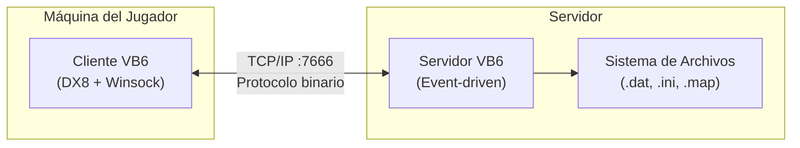
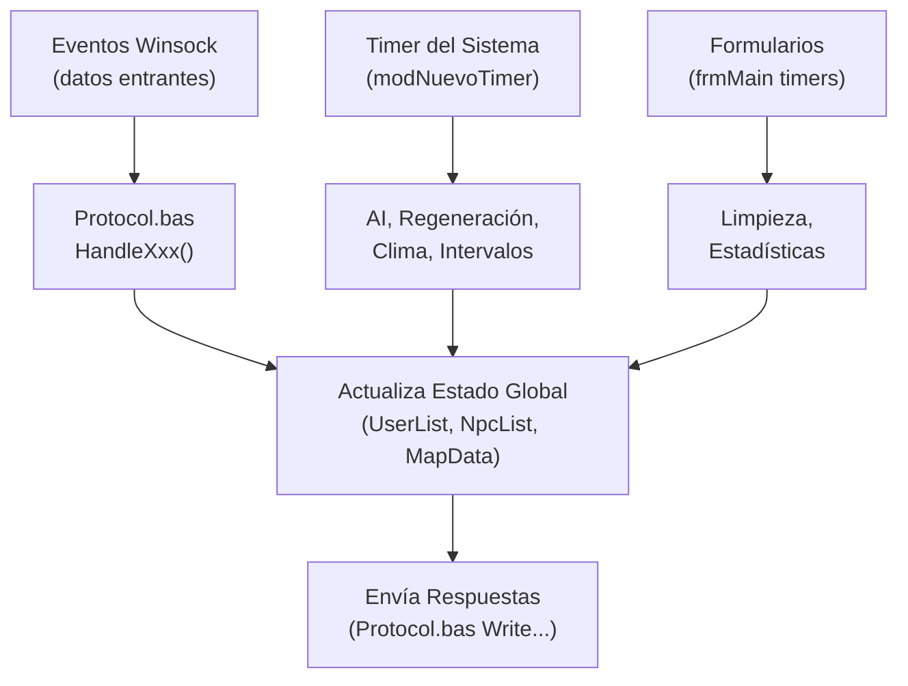
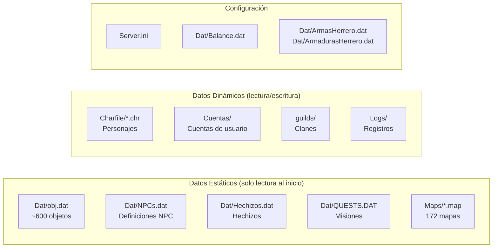
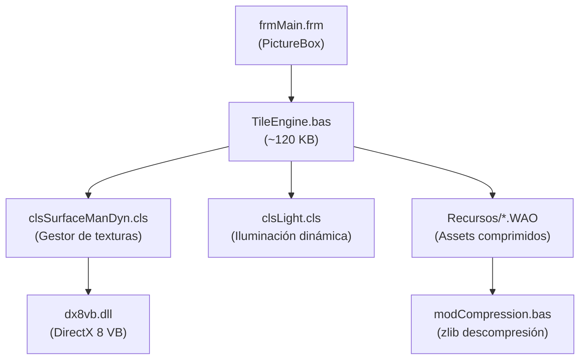
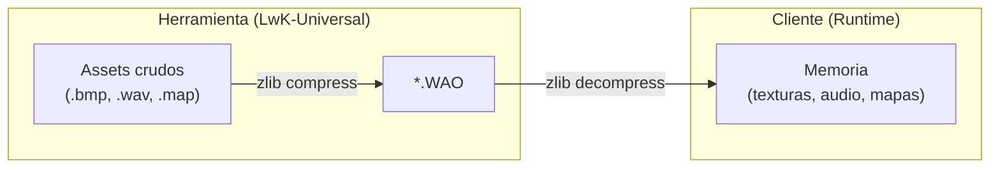
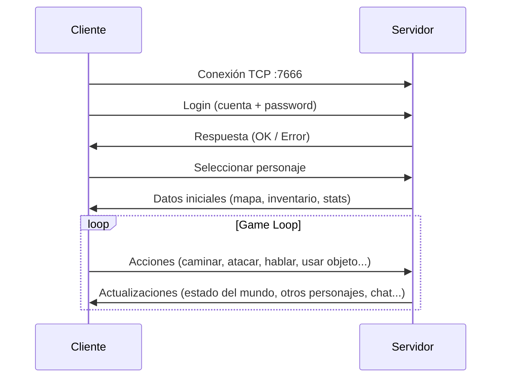

# Arquitectura de Winter-AO

> **Esta documentación fue generada por y para Comunidad-Winter con el objetivo de preservar recursos de Argentum Online.**

Visión de alto nivel de la arquitectura del sistema Winter-AO, deducida directamente del código fuente, archivos de proyecto `.vbp` y configuración.

---

## Patrón Arquitectónico

Winter-AO sigue el modelo **Cliente-Servidor monolítico** clásico de Argentum Online:



### Características fundamentales

| Propiedad | Valor | Verificación |
|-----------|-------|--------------|
| **Modelo de ejecución** | Single-threaded (runtime VB6) | Inherente al lenguaje |
| **Estado** | Stateful — todo el mundo en memoria | `Declares.bas`: arrays globales `UserList()`, `NpcList()`, `ObjData()` |
| **Concurrencia** | Pseudo-paralelismo via Timers + eventos Winsock | `modNuevoTimer.bas`, controles `CSWSK32.OCX` |
| **Max. usuarios** | 550 (configurable) | `Server.ini` → `MaxUsers=550` |
| **Puerto** | 7666 | `Server.ini` → `StartPort=7666` |

---

## 1. Servidor (`SERVER.VBP`)

### 1.1 Punto de Entrada

- **Startup**: `Sub Main()` en `General.bas` (línea 208).
- **Formulario principal**: `frmMain.frm` (ventana del servidor con controles administrativos).
- **Formularios auxiliares**: `frmServidor.frm` (configuración), `frmCargando.frm` (splash), `frmAdmin.frm`, `FrmStat.frm`, `FrmInterv.frm`, `frmTrafic.frm`, `frmUserList.frm`, `frmConID.frm`, `frmDebugNpc.frm`.

### 1.2 Game Loop (Event-Driven)

El servidor **no** tiene un bucle de juego explícito. La actualización del mundo se produce mediante:



### 1.3 Subsistema de Red

Verificado en `SERVER.VBP`:
- **Flag de compilación**: `UsarQueSocket = 1 : ConUpTime = 1`
- Cuando `UsarQueSocket = 1`, el servidor usa la API Winsock directa (`wsksock.bas` / `wskapiAO.bas`) en lugar del control OCX, para mayor rendimiento.
- **`TCP.bas`**: Gestión de conexiones, aceptación de clientes, envío/recepción de datos.
- **`Protocol.bas`** (~680 KB): El archivo más grande del proyecto. Contiene todos los enums `ServerPacketID`/`ClientPacketID` y las subrutinas `Handle*` (deserialización entrante) y `Write*` (serialización saliente).
- **`clsByteQueue.cls`**: Buffer circular de bytes para cola de paquetes por usuario.
- **`modSendData.bas`**: Funciones de broadcast (enviar a todos los usuarios en un área, mapa, etc.).

### 1.4 Persistencia (`FileIO.bas`)



**Formato**: Todo es texto plano (formato INI) o binario legacy. No hay base de datos SQL.

### 1.5 Entidades en Memoria

Declaradas como `Type` (structs) en `Declares.bas` y almacenadas en arrays globales:

| Array Global | Tipo | Propósito |
|-------------|------|-----------|
| `UserList()` | `tUser` | Estado de cada conexión/jugador activo |
| `NpcList()` | `tNPC` | NPCs del mundo (incluye IA, inventario, stats) |
| `ObjData()` | `tObjData` | Definiciones de objetos del juego |
| `MapData()` | `tMapData` | Datos de cada mapa cargado |
| `Hechizos()` | `tHechizo` | Definiciones de hechizos |

---

## 2. Cliente (`Client.vbp`)

### 2.1 Punto de Entrada

- **Startup**: `Sub Main()` en `General.bas` (línea 558).
- **Formulario principal**: `frmMain.frm` (~59 KB) — contiene el PictureBox de renderizado DX8, la consola de chat y el inventario.
- **Título**: "Winter AO Ultimate" · **Versión**: 4.0.3.

### 2.2 Motor de Renderizado



- **`TileEngine.bas`** (~120 KB): Módulo central del cliente. Renderizado isométrico 2D por capas, gestión de personajes en pantalla, efectos visuales, clima.
- **Resolución**: Configurable (no fija como en el AO clásico), con soporte de alpha blending y partículas.
- **Carga de recursos**: Los gráficos se extraen en runtime desde archivos `.WAO` mediante `modCompression.bas` + `zlib.dll`.

### 2.3 Formularios de Interfaz

El cliente usa **34+ formularios VB6** como interfaz de usuario, superpuestos al renderizado DX8:

| Categoría | Formularios |
|-----------|------------|
| **Login/Cuentas** | `frmConnect`, `FrmCuenta`, `frmCrearAccount`, `frmCrearPersonaje`, `frmBorrarPj`, `frmRecuperarAccount`, `frmNewPassword` |
| **Juego principal** | `frmMain` (HUD), `FrmEstadisticas`, `frmMapa` (minimapa), `frmOpciones` |
| **Comercio/NPC** | `frmComerciar`, `frmComerciarUsu`, `frmBancoObj`, `frmHerrero`, `frmCarp`, `frmEntrenador`, `frmCantidad` |
| **Social** | `frmGuildFoundation/Details/Adm/Brief/Leader/News/URL`, `frmSolicitud`, `frmUserRequest`, `frmParty`, `FrmInvGrupo` |
| **Misiones** | `frmQuests`, `frmQuestInfo` |
| **Admin/GM** | `frmPanelGm`, `frmGM`, `frmCambiaMotd`, `frmSpawnList` |
| **Otros** | `frmCreditos`, `frmCanjes`, `FrmTorneo`, `frmForo`, `frmCommet`, `frmCustomKeys`, `frmCargando`, `frmMSG`, `frmMensaje`, `frmEligeAlineacion` |

### 2.4 Protocolo (lado cliente)

- **`Protocol.bas`** (~320 KB): Contrapartida del servidor. Funciones `Write*` (enviar al servidor) y `Handle*` (procesar respuesta).
- **`ProtocolCmdParse.bas`** (~72 KB): Parsing de comandos de texto ingresados por el usuario (ej. `/meditar`, `/online`, comandos GM).
- **`clsByteQueue.cls`** (~41 KB): Buffer de bytes compartido con el servidor para serialización eficiente.

### 2.5 Audio

- **`clsAudio.cls`** (~31 KB): Gestión de música (MP3 via ActiveMovie/Quartz) y efectos de sonido.
- Referencia verificada a `quartz.dll` (ActiveMovie control) en `Client.vbp`.

---

## 3. Sistema de Recursos `.WAO`



| Archivo | Contenido | Tamaño |
|---------|-----------|--------|
| `Graphics.WAO` | Sprites del juego | ~36 MB |
| `Sounds.WAO` | Efectos de sonido | ~48 MB |
| `Musics.WAO` | Pistas de música | ~31 MB |
| `Interface.WAO` | Texturas de interfaz | ~7 MB |
| `Maps.WAO` | Mapas del juego | ~458 KB |
| `Scripts.WAO` | Datos de índices/scripts | ~198 KB |

---

## 4. Comunicación Cliente-Servidor

### Protocolo binario

```
┌──────────────────┬─────────────────────────┐
│ PacketID (1 byte)│ Datos (N bytes, variable)│
└──────────────────┴─────────────────────────┘
```

- **Formato**: Binario, Little-Endian (nativo VB6).
- **Codificación de strings**: ANSI (Windows-1252).
- **Seguridad**: CRC básico (`CrcSubKey=12345` en `Server.ini`), detección de clientes externos en el cliente (`ModSeguridad.bas`), encriptación activable (`Encriptar=1`).

### Flujo de conexión (inferido)



---

## 5. Dependencias COM

Verificadas en los archivos `.vbp` del proyecto:

| Componente | Archivo | Uso |
|-----------|---------|-----|
| DirectX 8 VB | `dx8vb.dll` | Renderizado gráfico (cliente + WorldEditor) |
| Winsock (CS) | `CSWSK32.OCX` | Red TCP del cliente |
| Winsock (MS) | `MSWINSCK.OCX` | Red TCP alternativa |
| MS Common Controls | `MSCOMCTL.OCX` | Controles de UI (TreeView, ListView, etc.) |
| RichTextBox | `RICHTX32.OCX` | Consola de chat enriquecida |
| Internet Transfer | `MSINET.OCX` | Actualizador del launcher |
| Common Dialog | `COMDLG32.OCX` | Diálogos de abrir/guardar (WorldEditor) |
| ActiveMovie | `quartz.dll` | Reproducción de audio MP3 |
| zlib | `zlib.dll` | Compresión/descompresión de archivos `.WAO` |
| Progress Bar | `vbalProgBar6.ocx` | Barras de progreso personalizadas |
